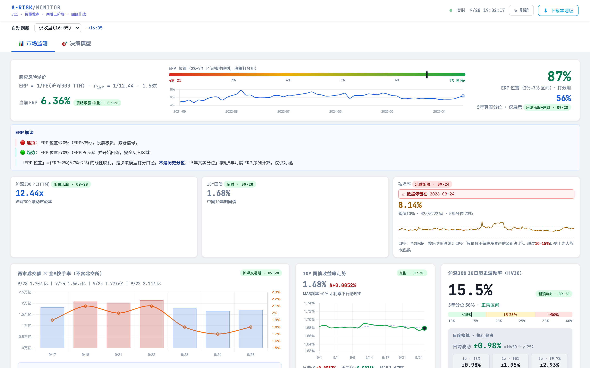

# A股风险监视器 · A-RISK/MONITOR

一个本地运行的 A 股大盘风险监测看板：ERP 股权风险溢价、沪深300 PE(TTM)、10Y 国债、破净率、两市成交额×换手率、HV30 波动率、主要指数（上证/深证成指/创业板指/科创50）走势与成交量趋势、信贷脉冲（社融存量同比一阶导）、两融余额+动量、ETF 资金流向、申万行业热力图，以及一个「两层漏斗决策模型」给出综合仓位建议。

数据每交易日收盘后自动抓取（AKShare + 央行官网直连 + 沪深交易所 + 新浪/东财），本地静态页面渲染，**无需任何后端服务器**。

面板上每个数字都带**来源 / 数据日期 / 是否估算**徽标；某项本次抓取失败、复用旧值时，卡片显示「⚠ 数据停留在 {日期}」，不会悄悄展示旧值。



> 📊 [查看完整长图（含 ETF 资金流向、行业热力图、决策模型）](docs/screenshot-full.png)

> ⚠️ 本项目仅供研究学习，所有指标不构成投资建议。投资有风险，入市需谨慎。

## 组成

| 文件 | 作用 |
|---|---|
| `arisk_monitor_local.html` | 看板本体（Chart.js 走 CDN，其余内联） |
| `vendor/html-to-image.js` | 板块「⤓ 存图」导出 PNG 的依赖（本地文件，**必须与看板同目录**） |
| `update_arisk_data.py` | 抓全量数据 → 生成 `arisk_data.json`（约 2–3 分钟，每段 180s 超时保护） |
| `proxy.py` | 本地代理(8899)，供浏览器盘中实时抓数 + 妙想API 转发 |
| `check_and_update.sh` | 检查所有日频字段的日期与 stale，任一落后/失败才更新 |
| `A股风险监测-数据更新.command` | 一键安装/卸载 launchd 每日自动更新（macOS，**Finder 里双击即可**） |
| `run_arisk_update.sh` | 跑一次更新（被 check 调用，或手动） |
| `start.sh` / `stop.sh` | 一键起停（代理 8899 + 静态服务器 8788） |
| `arisk_data.json` | 数据快照（仓库内为种子数据，跑一次更新即刷新） |
| `backtest_erp.py` | ERP 口径回测（结果见 `docs/erp_bt_result.md`） |

## 数据源与字段

`arisk_data.json` 中除 `generated_at` / `generated_date` 外，每个字段统一为：

```json
{"value": ..., "source": "央行", "date": "2026-09-25", "is_estimate": false, "stale": false, "note": "可选口径说明"}
```

`date` 是数据本身的日期（月频为 `YYYY-MM`），不是抓取时间；`stale=true` 表示本次抓取失败、复用了旧值。

| 字段 | 指标 | 数据源（按降级顺序） | 频率 |
|---|---|---|---|
| `pe_300` | 沪深300 PE(TTM) | 乐咕乐股（AKShare `stock_index_pe_lg`） | 日 |
| `bond10y` | 中国 10Y 国债 | 东财（AKShare `bond_zh_us_rate`） | 日 |
| `erp_history` | ERP 近5年真实分位（仅展示） | 乐咕乐股 + 东财，月末点对齐 | 月 |
| `below_net_asset` | 破净率（全部A股） | 乐咕乐股（`stock_a_below_net_asset_statistics`） | 日 |
| `turnover` / `vol_7d` | 全A换手率 / 两市成交额（不含北交所），序列均为**近 22 个交易日（≈1 个月）**；`turnover.series[]` 另带 `mktcap_total_yi`（沪深两市**总**市值，供巴菲特指标日线用，注意与 `mktcap_yi`＝**流通**市值不是一个口径） | 沪深交易所；交易所完全不可得时新浪估算兜底（标估算，同样取 22 日） | 日 |
| `hv30` | 沪深300 HV30 | 新浪K线 | 日 |
| `margin` | 两融余额 | 上交所 + 深交所（深市历史为东财转载的深交所数据，最新日经深交所官方核对）；深市不可得时按最近实测比例估算（标估算） | 日 |
| `credit_yoy` | 社融存量同比 | 央行（上年+当年表，往年归档页自动发现）→ 妙想（可选）→ 商务部镜像累计 → M2兜底（信号无效） | 月 |
| `sector_live` | 申万一级 60 日涨跌 / 当日涨跌 `today` | 申万宏源研究官网 API（`swsresearch.com`）。⚠️ **该源对当日数据有 1~2 天发布延迟**（实测 2026-09-28/29 两天的数据直到 9/30 上午才发布），所以本字段常年比同页其它日频字段晚 1~2 天，属正常；距今 ≥3 天会在更新日志里打 `⚠ 数据源滞后` 提示 | 日（发布有延迟） |
| `etf_categories` | ETF 60日份额变化（仅沪市） | 上交所份额 × 东财现价（新浪备用） | 日 |
| `fund_issuance` | 偏股基金新发（股票/混合，剔除偏债） | 东财 | 月 |
| `limit_7d` | 涨跌停家数 | 东财 | 日 |
| `index_trend` | 主要指数（上证/深证成指/创业板指/科创50）近 60 交易日点位 + 成交量趋势 | 新浪日K（`stock_zh_index_daily`），已与交易所官方成交量逐日核对 | 日 |
| `mktcap_gdp` | A股总市值 / GDP（巴菲特指标）。卡片**顶部「最新交易日」与走势图末点同为日线口径**（`cur_*`，另带日环比）；分位样本为月度全历史 | 日线分子：沪深交易所日频「市价总值」，直接复用 `turnover` 序列的 `mktcap_total_yi`（不重复请求）；月度分子：中经网转发国家统计局「沪深两市市价总值」；分母：国家统计局 GDP（季，还原单季后滚动四季，按发布日对齐） | 月度统计 + 日线 |
| `us_index_trend` | 美股主要指数（标普500 `.INX` / 纳斯达克综合 `.IXIC`）近 60 交易日点位 + 成交量趋势 | 新浪美股指数日K（`index_us_stock_sina`） | 日（美股交易日） |
| `gold` | **伦敦金现 XAU/USD** 现货收盘价（**美元/盎司**），近 30 交易日 | 新浪财经外盘日K（AKShare `futures_foreign_hist(symbol='XAU')`） | 日（伦敦金日历） |
| `us10y` | **美国** 10 年期国债收益率，近 30 交易日 | 东财/英为财情（AKShare `bond_zh_us_rate`，与 `bond10y` **同一份数据**，只是取另一列） | 日（美国交易日历） |

> ⚠️ **`index_trend` / `us_index_trend` 的数组契约**：每个 item 的 `dates` / `closes` / `vols` **必须等长且一一对应**（同一根 K 线的日期、收盘价、成交量），前端绘图是按索引配 `labels` 的。后端算 n 日涨跌会多取一天作基准，**那个基准值不能留在 `closes` 里**。历史 bug（2026-09-30 修）：`us_index_trend` 的 `closes` 曾比 `dates` 多一个，导致趋势线整体错位一天 —— 表现为「卡片数字显示下跌、趋势线最后一段却在涨」。

**口径说明**
- ERP = 1/PE(沪深300 TTM) − r10Y。决策打分用「ERP 位置」= (ERP−2%)/(7%−2%) 线性映射——它**不是历史分位**；横幅上并列的「5年真实分位」仅供对照。`backtest_erp.py` 对比 6 种口径后，沪深300·线性映射的 12 个月 IC 最高（2016 起 0.45，2011 起 0.57），故沿用。
- 换手率同理，决策页的「换手率位置」是 换手率/3.5% 的线性映射。
- **指数成交量口径**：`index_trend` 的成交量取「该市场/板块全部股票」的成交量（亿股）。经核对：上证指数 volume = 沪市全部（2026-09-28 新浪 452.35 亿股 vs 上交所官方 453.06 亿股）；深证成指与深证综指、创业板指与创业板综的 volume 是同一序列，即深市/创业板全部。**科创50 的 volume 只含 50 只成分股**，故科创板量能改用科创综指（`sh000680`，全部科创板），与其余三块口径一致。

- **巴菲特指标口径**：`mktcap_gdp` 分子只含**沪深两市**月末市价总值（**不含北交所**，也不含港股与境外上市中概股），因此比「全部中国公司」口径偏低，不可与不同口径的公开数值直接对比；分母是 **GDP 滚动四季（TTM）** —— 统计局按累计值发布（"第1-2季度"＝上半年累计），代码先还原成单季再滚动求和，并只采用「该月月底前已发布」的季度（发布日近似 Q1→4/17、Q2→7/15、Q3→10/18、Q4→次年1/17），避免前视偏差，故曲线在 4/7/10/次年1 月出现台阶属发布节奏。分位是**真实历史分位**，非区间线性映射。
  - **顶部口径（2026-09-30 起）**：卡片顶部「最新交易日 / 总市值 / GDP / 日环比 / 分位」全部取**日线**（`cur_*`），与走势图末点同一时点。分位的**样本**仍是月度全历史序列（224 月，自 2008-01）——分位只有月度频率才有完整可比样本，所以卡片脚注写明「频率不同、时点一致」。日线缺失时前端自动退回月度口径并在卡片上如实标注（大数字上方的标签 `#mg-label` 由「最新交易日」切换为**「月末口径（日线不可用）」**），**不会把月度值伪装成当日值**。此前顶部固定取月度末行，会长期比走势图滞后一个月（如顶部 2026-08 的 80.51% vs 图上 09-29 的 76.92%）。
- **黄金 / 美债口径**：`gold` 取**伦敦金现 XAU/USD**（国际现货金基准价，**美元/盎司**）而非 COMEX 期货主连 —— 主连换月会产生与行情无关的跳变，当"走势"看会误导。2026-09-30 由「上海金 Au99.99（元/克）」切换而来（用户要看国际通用口径做横向对比）；国内上海金与国际盘的换算关系为 `XAU × USD/CNY ÷ 31.1035 ≈ 元/克`。注意伦敦金 24 小时交易，**当日最后一根K线在欧美盘收完前是盘中价**，次日才固定。加密口径提示：`chg` 仍存绝对价差，但前端 `pctMode` 使黄金卡**日涨跌 / 周变化 / 区间变化一律显示百分比**。`us10y` 与 `bond10y` **同源同频但独立成段**：`bond10y` 是 `DM_INPUTS`（ERP / 决策模型的输入），混入美国利率会让打分口径出错。
  - **配色**：美债卡沿用同页「10Y 国债」规则 —— **红＝利率上行 / 绿＝利率下行**。这与股票/黄金的「红涨绿跌」**符号相同、含义不同**：美债利率上行对 A 股是**估值压力**（分母端），不是利好。⚠️ **这层辨析只保留在这里，卡面上已按用户要求删去**（2026-09-30 判为"废话"），阅读时需自查。金/美债两卡的**「当前值」与「日涨跌 / 周变化 / 区间变化」同色**（平盘为灰），颜色只由 **当日** 方向决定 —— 与「主要指数」卡的 `.idx-px` 完全一致（该约定 2026-09-30 补齐，此前大数字恒为默认色）。**MA5 与「中美10年利差」是水平值，不参与涨跌着色。**
  - **脚注从简**（2026-09-30 用户要求）：两卡脚注各只留 2 条 —— 全是**口径 / 来源 / 时效**这类会造成误读的信息（如"伦敦金当日K线是盘中价"）。**换算公式、配色道理、"两者符号相同含义不同"之类的解释性文字不要再往卡面上写**。
  - 美债卡内「中美10年利差」＝中国10Y − 美国10Y，**只作一行文字参考，不单独画线**。
- **指数卡右上角**：显示「最新收盘点位 + 当日涨跌」（`chg1d`，较前一交易日收盘），两者**同色**，A 股惯例红涨绿跌、平盘灰；卡片下方 5/20/60 日为该区间**累计**涨跌幅，口径不同不可混看。当日涨跌原先重复出现在下方涨跌行中，现已移除该行首项。
- **美股指数成交量口径**：`us_index_trend` 的 volume 是「该指数所覆盖标的的当日成交股数」——标普500 为其成分股合计、纳斯达克综合为纳指全市场，**覆盖范围不同，量能不可跨指数比较**，只能看各自变化趋势。另美股交易日/时区与 A 股不同，最后一根K线通常早 1 个交易日，卡片数据日期以**右上角徽标**为准。
- **两融口径（两个序列别混）**：`margin.daily` 是交易所**每日**披露的两融余额（T+1 可见，卡片主图＝该序列近 30 个交易日）；`margin.monthly` 是把 daily 按自然月取月末值后的序列，**只**用于「月增速」与 ROC 二阶导（决策模型的 `marginSlopeZ` 也由它算）。所以卡片主图是日频、ROC 子图是月频，**属设计而非数据滞后**。
- **涨跌/资金流向配色统一为 A 股惯例：红＝涨（净流入）/ 绿＝跌（净流出）**、持平为灰。涉及指数卡右上角「点位+涨跌」、**黄金/美债趋势卡的「当前值+涨跌」**、ETF 资金分类流向格、申万行业热力图。注意这与看板里「绿＝风险低」等指标语义**不同**，两者不共用色板（见页面 CSS `.c-up` / `.c-down` 的注释）。ETF 格的深浅按**净变化额相对强度**（`|chg| / max|chg|`，非百分比）分档，避免小基数类别因高百分比抢眼。

**字段更名（升级自旧版时注意）**：`m2_monthly → credit_yoy`、`sector_live[].excess → today`、页面 JS `peFullA → pe300`；`/pe` 不再返回 `pb`。

**前端缓存契约（改数据字段前必读）**

页面用 `localStorage[CKEY]` 缓存整个数据对象，带**两枚**版本戳，任一不符即作废并强制重拉：

| 戳 | 含义 | 何时失效 |
|---|---|---|
| `gen` | 预构建 JSON 的 `generated_at` | 后台数据一更新（无需手动清缓存） |
| `schema` | 前端**载荷结构**版本（`SCHEMA` 常量） | 页面代码改动导致缓存对象**字段增减**时 |

⚠️ 二者缺一不可：`gen` 只盯得住数据、盯不住代码。曾出现「两融日度序列」是新字段、而用户浏览器里的缓存仍是旧结构（`gen` 未变 → 判定有效），渲染时取不到 `d.marginDailySeries`，主图直接被清空，看起来就是「两融每日趋势是空的」。

> **凡改动缓存对象的字段结构，必须把 `SCHEMA` 和 `CKEY` 一起 +1。**（同时顺手 `localStorage.removeItem` 掉上一代 key。）

## 卡片布局要点

- **单卡整行**：绝大多数卡片是 `#pg` 的直接子元素（`<div class="card full fi">`），占满整行。
- **两卡并排**：需要并排的两张卡包进 `<div class="row3b fi">`（`grid-template-columns:1fr 1fr`），内层卡去掉 `full` 类写成 `<div class="card">`。目前只有**「美国10年期国债收益率」+「伦敦金现 XAU」**这一组这么放（与「美股主要指数」卡相邻，同属跨市场参照）。窄屏（≤960px）由媒体查询自动降为单列。
- ⚠️ **`.row3b` 是「分享」按钮注入选择器的白名单之一**：`injectShareButtons()` 只扫 `#pg > .card`、`#pg > .row3b > .card`、`#pg > .erp-banner`。若把卡片塞进别的容器类，**该卡会静默丢失「分享」按钮**——新增布局容器时必须同步改这个选择器。
- **卡内不重复展示数据日期**：数据来源 / 日期 / 估算 / 滞后统一由卡片右上角的 `.vbadge[data-meta="<字段>"]` 承载（`renderMeta()` 渲染，例：`英为财情(经akshare) · 09-29`）。卡内**不要再写一行「数据日期 …」**——信息重复且会挤占空间。
  - 黄金 / 美债两张走势卡副行原本是 `MA5 xx`（与图下那行的 MA5 **重复**），现改为**「近 N 个交易日」**（样本区间长度，别处没有）。`update_arisk_data.py` 的 `is_estimate` 标记也由徽标负责显示，故 `renderTrendCard()` 不再需要 meta 参数。
  - **2026-09-30 已按此约定清完全部 3 处遗留**：A股指数卡 `#idx-asof`、美股指数卡 `#usidx-asof`（均由 `renderIndexTrend()` 渲染同一文案 `数据日期 … · 近 60 个交易日`）、巴菲特卡 `#mg-asof`（`最新交易日 … · 日线口径 ｜ 上次月末 …`）。**新卡不要再引入这类行。**
  - ⚠️ **删日期行前先查它有没有兼任"降级提示"**。巴菲特卡那行同时承担「日线抓取失败 → 已退回月度口径」的告知义务，直接删会让顶部**静默显示月末值、被当成当日值**。做法是把提示挪到卡内已有元素上（给写死的「最新交易日」标签加 `#mg-label`，JS 按 `hasCur` 切文案），而不是连提示一起删。**"冗余"与"安全网"常常共用一行，删之前先看 else 分支。**
- **并排卡的头部必须结构一致**：两卡标题长度天然不同（「美国10年期国债收益率 · 走势」长于「伦敦金现 XAU · 走势」）。头部**只保留「标题 + 分享 + 徽标」一项**（上面那条已把日期行删掉），两卡头部自然都是单行、下面的大数字与图表才不会错位。图表高度两张卡统一 **150px**（整行卡仍为 200px）。

## 板块分享（导出 PNG）

每个板块标题文字后面都有一个「分享」按钮（`injectShareButtons()` 注入 13 处），点击把该板块整块渲染成 PNG 下载，文件名＝板块标题 + 时间戳。并排卡导出的 PNG 自然只有半宽，属预期。

实现要点（改这段前先读，两个坑都真踩过）：

- **按钮不出现在图里的做法**：用 `html-to-image` 的 `filter` 回调在**克隆体**上剔除 `.share-btn`（`filter:n=>!(n.classList&&n.classList.contains('share-btn'))`）。**不要改实时 DOM**——早期版本是把所有 `.share-btn` 设成 `display:none` 再导出，而导出本身要跑十几秒，按钮连「生成中…」提示一起消失，表现就是「一点分享按钮就没了」。
- **`skipFonts:true` 必开**：本页 CSS 未声明任何 `@font-face`（纯系统字体），但 html-to-image 默认会走一遍 Web 字体嵌入流程，实测同一张卡 **8.3s / 25.8MB SVG → 0.34s / 0.5MB**，画面无差异。**这是导出慢的唯一主因，不是 canvas 或 pixelRatio。**
- 另加 60 秒超时兜底（`Promise.race`）+ `btn.dataset.busy` 防重复点击，按钮状态一律在 `finally` 复位。
- 文件名取自 `.card-title`，而按钮就挂在标题元素内部，所以 `_shareTitle()` 必须先 `cloneNode` 再移除 `.share-btn`，否则导出名会多一些「分享」两个字。

## 快速开始

```bash
git clone <你的仓库地址> arisk
cd arisk

# 1. 建虚拟环境 + 装依赖（需 Python 3.9+）
python3 -m venv venv
./venv/bin/pip install -r requirements.txt

# 2.（可选）配妙想 API key；不配也能跑，社融走央行直连（妙想仅作为央行失败时的降级源）
cp .env.example .env
#   然后编辑 .env 填入 MX_APIKEY

# 3. 首次抓数
./venv/bin/python update_arisk_data.py

# 4. 启动并打开看板
bash start.sh
```

看板地址：<http://localhost:8788/arisk_monitor_local.html>

> ⚠️ **必须通过 `start.sh`（本地 http）打开，不能直接双击 HTML**——`file://` 协议下浏览器禁止读取本地 JSON，页面会空白。

停止服务：`bash stop.sh`

### 只重算某一段（改口径后不必等全量）

全量抓数约 **35 分钟**。改过 `update_arisk_data.py` 某段的口径或字段后，想立刻让新字段落地，用：

```bash
./venv/bin/python recalc_section.py gold us10y      # 可用的段见脚本内 BUILDERS
./venv/bin/python recalc_section.py mktcap_gdp      # 依赖 JSON 里已有的 turnover，不能用于首次生成
```

它**直接 import `update_arisk_data` 里对应的 `fetch_*`**，逻辑与全量完全一致，不会出现「补算结果和全量结果不一致」；某段失败则跳过、全部失败则不写回。注意它**不改 `generated_at`**：其余段仍是上一次全量的数据，把生成时间改成本刻属于虚报（前端缓存靠 `CKEY`/`SCHEMA` 失效，不依赖该时间戳）。

## 每日自动更新

数据只在**交易日收盘后（约 18:00 起）**发布，`check_and_update.sh` 会判断当前数据是否已覆盖最新交易日：已覆盖则秒退，落后才抓。

**macOS（launchd）一键安装** —— 在 **Finder 里双击 `A股风险监测-数据更新.command`** 即可，会自动打开终端窗口完成安装（幂等，可反复运行）。安装 launchd 任务需要用户级权限，普通沙盒 / 容器，或 AI 助手进程都做不到，**必须由你在自己的登录会话里触发**。

```bash
bash "A股风险监测-数据更新.command"             # 安装并加载（等价于双击）
bash "A股风险监测-数据更新.command" --uninstall  # 卸载
```

等价的手工步骤：见 `com.arisk.update.plist.example`，把 `__ARISK_DIR__` 换成本目录绝对路径后装入 `~/Library/LaunchAgents/`，再 `launchctl bootstrap gui/$(id -u) ~/Library/LaunchAgents/com.arisk.update.plist`。每天 16:10–22:10 每小时判断一次。

- **Linux（cron）**：`crontab -e` 添加
  ```
  10 16-22 * * * /bin/bash /path/to/arisk/check_and_update.sh
  ```

手动立即更新：`bash run_arisk_update.sh`

## 已知限制

- **数据源在中国境内**（东财/新浪/央行）。海外服务器直连可能受限或较慢，`proxy.py` 已用 `curl_cffi` 模拟 Chrome TLS 指纹绕过部分反爬；仍不通时需自行加代理。
- `proxy.py` 的语义端点（`/pe` `/bond` `/sectors` `/margin` `/sf` `/fund` `/index` `/prebuilt`）都读同一份 `arisk_data.json`，原样返回上述统一结构；面板没有分钟级盘中刷新。
- 妙想 API（`MX_APIKEY`）为可选数据源：配置后作为社融降级链第二级；`proxy.py` 的 `POST /mx` 保留给盘中手动查询。未配置时一切照常，日志提示「未配置，跳过」。
- 旧版的「AI 验证」（浏览器直连 api.anthropic.com）已移除。

## 安全

`.env` 含你的 API key，已被 `.gitignore` 排除。**切勿把真实 `.env` 提交或分享。** 如误提交，请立即在东财后台吊销并更换 key。
